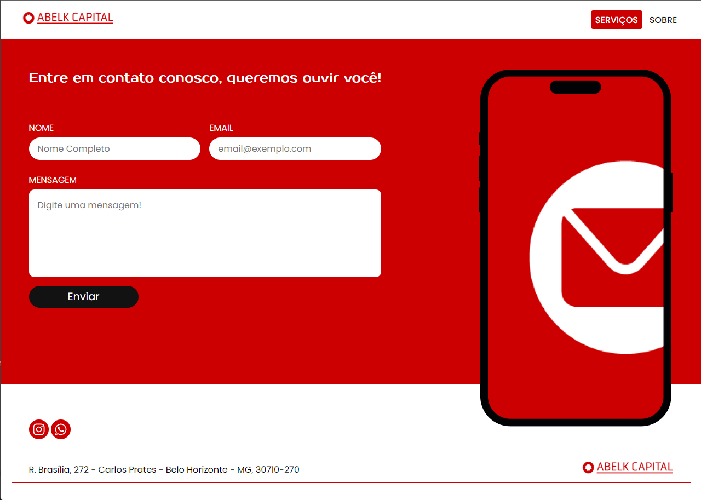

# Site Abelk Capital

## Sobre

E um site criado para a empresa Abelk Capital onde mostra os serviços prestados pela empresa contendo um formulário para contato, para que cliente possa colocar seu nome, email e enviar sua mensagem. A empresa recebe esse email e assim consseguindo uma forma de contato com o cliente.

## Acesso ao projeto

O Site também contém uma página sobre a empresa, <a href="https://abelkgroup.com.br/">Clique Aqui</a> e veja o site completo hospedado na hostinger!

## Tecnologias utilizadas

   
   
   
   
   

CSS, React JS, React Hook Form, Email JS, Swiper e React Icons.
